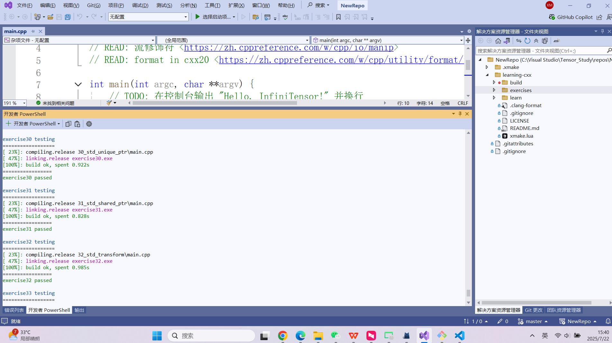



(base) PS C:\Visual Studio\Tensor_Study\repos\git\learning-cxx> xmake run summary
checking for platform ... windows
checking for architecture ... x64
checking for Microsoft Visual Studio (x64) version ... 2022
checking for Microsoft C/C++ Compiler (x64) version ... 19.44.35213
[ 23%]: compiling.release learn\summary.cpp
[ 23%]: compiling.release learn\test.cpp
learn\test.cpp(33): warning C4996: 'sprintf': This function or variable may be unsafe. Consider using sprintf_s instead. To disable deprecation, use _CRT_SECURE_NO_WARNINGS. See online help for details.
[ 35%]: linking.release test.lib
[ 71%]: linking.release summary.exe
exercise00 testing
==================
checking for platform ... windows
checking for architecture ... x64
checking for Microsoft Visual Studio (x64) version ... 2022
checking for Microsoft C/C++ Compiler (x64) version ... 19.44.35213
[ 23%]: compiling.release 00_hello_world\main.cpp
[ 47%]: linking.release exercise00.exe
[100%]: build ok, spent 0.985s
Hello, InfiniTensor!
=================
exercise00 passed

exercise01 testing
==================
[ 23%]: compiling.release 01_variable&add\main.cpp
[ 47%]: linking.release exercise01.exe
[100%]: build ok, spent 0.734s
10 + 10 = 20
=================
exercise01 passed

exercise02 testing
==================
[ 23%]: compiling.release 02_function\main.cpp
[ 47%]: linking.release exercise02.exe
[100%]: build ok, spent 0.718s
1 + 2 = 3
=================
exercise02 passed

exercise03 testing
==================
[ 23%]: compiling.release 03_argument&parameter\main.cpp
[ 47%]: linking.release exercise03.exe
[100%]: build ok, spent 0.734s
befor func call: 99
befor add: 99
after add: 100
after func call: 99
=================
exercise03 passed

exercise04 testing
==================
[ 23%]: compiling.release 04_static\main.cpp
[ 47%]: linking.release exercise04.exe
[100%]: build ok, spent 0.734s
=================
exercise04 passed

exercise05 testing
==================
[ 23%]: compiling.release 05_constexpr\main.cpp
[ 47%]: linking.release exercise05.exe
[100%]: build ok, spent 0.781s
fibonacci(20) = 6765
fibonacci(9) = 34
=================
exercise05 passed

exercise06 testing
==================
[ 23%]: compiling.release 06_array\main.cpp
[ 47%]: linking.release exercise06.exe
[100%]: build ok, spent 0.734s
=================
exercise06 passed

exercise07 testing
==================
[ 23%]: compiling.release 07_loop\main.cpp
[ 47%]: linking.release exercise07.exe
[100%]: build ok, spent 0.719s
fibonacci(90) = 2880067194370816120
=================
exercise07 passed

exercise08 testing
==================
[ 23%]: compiling.release 08_pointer\main.cpp
[ 47%]: linking.release exercise08.exe
[100%]: build ok, spent 0.75s
=================
exercise08 passed

exercise09 testing
==================
[ 23%]: compiling.release 09_enum&union\main.cpp
[ 47%]: linking.release exercise09.exe
[100%]: build ok, spent 0.734s
=================
exercise09 passed

exercise10 testing
==================
[ 23%]: compiling.release 10_trivial\main.cpp
[ 47%]: linking.release exercise10.exe
[100%]: build ok, spent 0.719s
fibonacci(10) = 55
=================
exercise10 passed

exercise11 testing
==================
[ 23%]: compiling.release 11_method\main.cpp
[ 47%]: linking.release exercise11.exe
[100%]: build ok, spent 0.75s
fibonacci(10) = 55
=================
exercise11 passed

exercise12 testing
==================
[ 23%]: compiling.release 12_method_const\main.cpp
[ 47%]: linking.release exercise12.exe
[100%]: build ok, spent 0.75s
fibonacci(10) = 55
=================
exercise12 passed

exercise13 testing
==================
[ 23%]: compiling.release 13_class\main.cpp
[ 47%]: linking.release exercise13.exe
[100%]: build ok, spent 0.719s
fibonacci(10) = 55
=================
exercise13 passed

exercise14 testing
==================
[ 23%]: compiling.release 14_class_destruct\main.cpp
[ 47%]: linking.release exercise14.exe
[100%]: build ok, spent 0.688s
fibonacci(10) = 55
=================
exercise14 passed

exercise15 testing
==================
[ 23%]: compiling.release 15_class_clone\main.cpp
[ 47%]: linking.release exercise15.exe
[100%]: build ok, spent 0.75s
=================
exercise15 passed

exercise16 testing
==================
[ 23%]: compiling.release 16_class_move\main.cpp
[ 47%]: linking.release exercise16.exe
[100%]: build ok, spent 0.719s
=================
exercise16 passed

exercise17 testing
==================
[ 23%]: compiling.release 17_class_derive\main.cpp
[ 47%]: linking.release exercise17.exe
[100%]: build ok, spent 0.75s
1. X(1)
2. A(2)
3. A(1)
4. X(3)
5. B(1, X(3))

-------------------------

1. A(1)
2. X(5)
3. B(1, X(5))
4. A(A const &) : a(1)
5. ~B(1, X(5))
6. ~X(5)
7. ~A(1)

-------------------------

1. ~A(1)
2. ~B(1, X(3))
3. ~X(3)
4. ~A(1)
5. ~A(2)
6. ~X(1)
=================
exercise17 passed

exercise18 testing
==================
[ 23%]: compiling.release 18_class_virtual\main.cpp
[ 47%]: linking.release exercise18.exe
[100%]: build ok, spent 0.75s
=================
exercise18 passed

exercise19 testing
==================
[ 23%]: compiling.release 19_class_virtual_destruct\main.cpp
[ 47%]: linking.release exercise19.exe
[100%]: build ok, spent 0.797s
=================
exercise19 passed

exercise20 testing
==================
[ 23%]: compiling.release 20_function_template\main.cpp
[ 47%]: linking.release exercise20.exe
[100%]: build ok, spent 0.734s
=================
exercise20 passed

exercise21 testing
==================
[ 23%]: compiling.release 21_runtime_datatype\main.cpp
[ 47%]: linking.release exercise21.exe
[100%]: build ok, spent 0.828s
=================
exercise21 passed

exercise22 testing
==================
[ 23%]: compiling.release 22_class_template\main.cpp
[ 47%]: linking.release exercise22.exe
[100%]: build ok, spent 0.812s
=================
exercise22 passed

exercise23 testing
==================
[ 23%]: compiling.release 23_template_const\main.cpp
[ 47%]: linking.release exercise23.exe
[100%]: build ok, spent 0.828s
=================
exercise23 passed

exercise24 testing
==================
[ 23%]: compiling.release 24_std_array\main.cpp
[ 47%]: linking.release exercise24.exe
[100%]: build ok, spent 0.765s
=================
exercise24 passed

exercise25 testing
==================
[ 23%]: compiling.release 25_std_vector\main.cpp
[ 47%]: linking.release exercise25.exe
[100%]: build ok, spent 1.125s
=================
exercise25 passed

exercise26 testing
==================
[ 23%]: compiling.release 26_std_vector_bool\main.cpp
[ 47%]: linking.release exercise26.exe
[100%]: build ok, spent 0.906s
sizeof(std::vector<bool>) = 32
=================
exercise26 passed

exercise27 testing
==================
[ 23%]: compiling.release 27_strides\main.cpp
[ 47%]: linking.release exercise27.exe
[100%]: build ok, spent 0.906s
=================
exercise27 passed

exercise28 testing
==================
[ 23%]: compiling.release 28_std_string\main.cpp
[ 47%]: linking.release exercise28.exe
[100%]: build ok, spent 0.813s
=================
exercise28 passed

exercise29 testing
==================
[ 23%]: compiling.release 29_std_map\main.cpp
[ 47%]: linking.release exercise29.exe
[100%]: build ok, spent 1.031s
=================
exercise29 passed

exercise30 testing
==================
[ 23%]: compiling.release 30_std_unique_ptr\main.cpp
[ 47%]: linking.release exercise30.exe
[100%]: build ok, spent 0.922s
=================
exercise30 passed

exercise31 testing
==================
[ 23%]: compiling.release 31_std_shared_ptr\main.cpp
[ 47%]: linking.release exercise31.exe
[100%]: build ok, spent 0.828s
=================
exercise31 passed

exercise32 testing
==================
[ 23%]: compiling.release 32_std_transform\main.cpp
[ 47%]: linking.release exercise32.exe
[100%]: build ok, spent 0.985s
=================
exercise32 passed

exercise33 testing
==================
[ 23%]: compiling.release 33_std_accumulate\main.cpp
[ 47%]: linking.release exercise33.exe
[100%]: build ok, spent 0.719s
=================
exercise33 passed

34/34 [##################################]